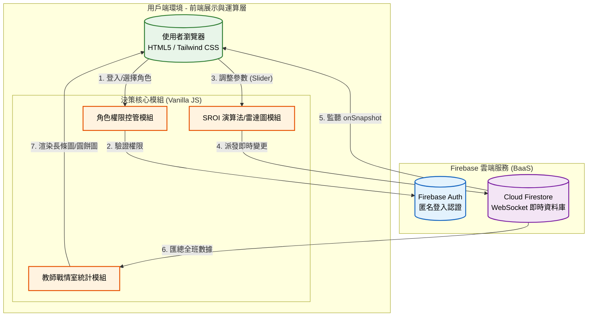

# 碳吉 TanJi：CCUS 淨零決策模擬系統 🌍

## 1. 專案介紹

### 1.1 系統目的簡介

本系統為「115 年度第二屆 CCUS 創意教案」之專屬數位互動工具。旨在透過「**角色扮演（Role-Play）**」與「**多端即時協作**」機制，引導學生模擬真實世界中推動 CCUS（碳捕捉、利用與封存）專案時，所需面臨的跨領域決策與妥協。
小組成員將分別擔任不同利害關係人（政策分析師、環境工程師、財務長、公關、生態保育員），在不同的場址（外海、工業區、深山）中調整安全、預算、回饋金與生態補償參數，藉由系統內建的演算法，即時推算專案的 **SROI 綜合評分（社會投資報酬率）**，並提供教師專屬的戰情室儀表板以利即時檢視全班學習成果。

---

## 2. 系統架構與範圍

### 2.1 系統架構圖

本系統採用 **純前端架構 + Firebase 雲端即時資料庫** 設計，透過無伺服器（Serverless）架構實現跨裝置的毫秒級狀態同步。

### 2.2 系統範圍

* **展示層**: 使用 Tailwind CSS 打造高流暢度的行動端優先 (Mobile-first) 介面，搭配 `Chart.js` 實現即時互動雷達圖與統計圖表。
* **業務邏輯層**: 包含 5 種角色權限鎖定機制、3 種場址基準分設定，以及安全性 (S)、經濟性 (E)、社會性 (O) 的多變數加權演算法。
* **資料存取層**: 透過 Firebase `onSnapshot` 實現 WebSockets 即時雙向綁定。若無網路或未配置金鑰，系統具備自動降級的「單機展示模式 (Demo Mode)」。

---

## 3. 業務功能需求

| 需求編號 | 功能名稱 | 參與者 | 功能描述 | 業務邏輯/備註 |
| --- | --- | --- | --- | --- |
| **FR-01** | **群組與角色登入** | 學生 | 輸入小組名稱並從 5 個職位中選擇 1 個登入。系統會自動分配對應的操作權限。 | 若輸入特定教師代碼（`880619`），將自動跳轉至戰情室。 |
| **FR-02** | **跨端決策與權限鎖** | 學生 | 各角色僅能滑動專屬的參數條（如財務長僅能調預算）。未獲授權的參數條會顯示「🔒 等待操作」或「僅分析師可操作」。 | 本機調整後，Firebase 將即時同步變更給同組的其他成員。 |
| **FR-03** | **SROI 評測與雷達圖** | 系統 | 根據目前的場址、安全、回饋金、補償與預算設定，動態計算專案的安全性、經濟性與社會性，並重繪雷達圖。 | 具有防呆機制（例如：工業區若安全評分過低，將觸發社會性大幅扣分懲罰）。 |
| **FR-04** | **最終決策提交** | 政策分析師 | 僅「政策分析師（隊長）」擁有「提交決策」按鈕，點擊後會鎖定全組畫面，並將最終 SROI 上傳至戰情室。 | 隊長亦可隨時「撤回決策」以重新討論。 |
| **FR-05** | **教師戰情總覽** | 教師 | 提供即時大數據看板，顯示全班在線組數、場址選擇圓餅圖、三項指標平均長條圖，以及 SROI 總分排行榜。 | 內建一鍵「重置」按鈕，可清空所有小組的雲端資料以利下一班上課。 |

---

## 4. 系統演算法與模型設計

### SROI 計算模型核心概念

系統根據三個 CCUS 潛在場址設定基準分，並透過學生調整的變數進行加減權重：

* **選址基準 (Base Score)**：
* `A (外海)`：安全高、經濟低、社會接受高。
* `B (工業區)`：安全低、經濟極高、社會接受極低。
* `C (深山)`：各項指標居中。

* **變數交互影響**：
* **安全性 (S)**：由「安全監測投資」與「生態補償」正向影響，受「預算緊縮」負向影響。
* **經濟性 (E)**：安全規格越高，支出呈「指數型增長（$x^{1.2}$）」，大幅拉低經濟性；預算緊縮能提升經濟性。
* **社會性 (O)**：受「回饋金」與「生態補償」正向影響。若場址選在「工業區」且安全性不及格，會觸發民眾抗議，扣除 20 分懲罰。

* **綜合 SROI 產出**： $Total = (S \times 40\%) + (E \times 25\%) + (O \times 35\%)$

---

## 5. 非業務功能需求

### 5.1 安全性要求

* **雲端認證**: 採用 Firebase Anonymous Auth (匿名登入) 進行連線授權，不需學生提供真實個資（免帳號密碼）。
* **防衝突機制**: 即時協作日誌 (System Log) 可追溯何人於何時更改了何種參數，避免小組內操作衝突。

### 5.2 系統效能

* **動畫與渲染**: 運用 CSS 硬體加速 (Transform) 處理所有動態效果與鎖定面板，確保手機端操作無卡頓。
* **節流設計 (Throttling)**: Slider 拖曳時僅更新本機視圖與計算，待滑開 (onChange) 才發送 API 請求，減少資料庫讀寫成本。

### 5.3 容錯與降級機制 (Graceful Degradation)

* **Demo Mode (單機模式)**: 當網路斷線、未設置 Firebase 金鑰，或資料庫讀取超時，系統將自動啟動「本機模式」，確保課程教學不因網路或伺服器問題而中斷（戰情室會載入虛擬的範例資料供展示）。

---

## 6. 安裝與部署

### 前置需求

* 現代瀏覽器（建議 Chrome, Safari, Edge）。
* 若需啟用即時連線，需準備一組 **Firebase 專案 (需開啟 Firestore 與 Anonymous Auth)**。

### 部署步驟

1. **取得原始碼**: 下載包含 HTML、CSS 與 JS 的單一 `index.html` 檔案。
2. **設定 Firebase (選擇性)**:
* 在 HTML 檔案底部的 `<script type="module">` 區塊中，替換 `firebaseConfig` 為您自己的 Firebase 專案金鑰。

3. **本地或線上執行**:
* 直接雙擊 `index.html` 或將其放置於 GitHub Pages、Vercel 等靜態伺服器上即可使用。

4. **教師登入**:
* 在登入畫面的「小組名稱」輸入預設密碼 `880619`，即可進入戰情室介面。
